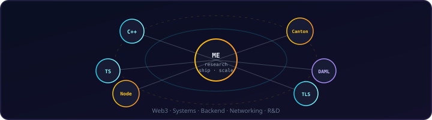
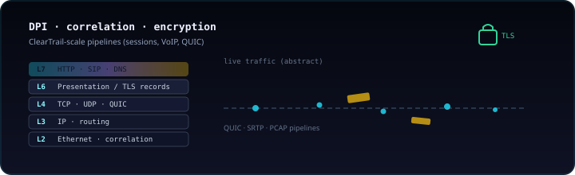
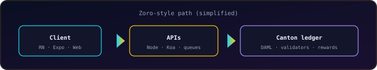

<!--
  README images use repo-relative paths (readme-assets/*.svg, workbench.svg, public/...).
  They only render if those files exist on the same GitHub branch as this README.
  If you paste this README into another repo, copy readme-assets/ (and other assets) or switch img src to raw.githubusercontent.com URLs.
-->
<h1 align="center">
  Hi, I'm <a href="https://github.com/geeky01adarsh" target="_blank" rel="noreferrer">Adarsh Navneet Sinha</a> 💙 
  Software Engineer · Web3, systems, and backend
</h1>

  <a href="https://geeky01adarsh.github.io/portfolioV2/" target="_blank" rel="noreferrer"><strong>Live portfolio app →</strong></a>
  &nbsp;·&nbsp;
  <a href="https://www.linkedin.com/in/adarsh91094" target="_blank" rel="noreferrer">LinkedIn</a>
  &nbsp;·&nbsp;
  <a href="mailto:adarsh91094@gmail.com">Email</a>

<h3 align="center">Workspace &amp; portfolio art</h3>
<table width="100%">
  <tr>
    <td align="center" width="44%" valign="middle" bgcolor="#eceff4">
      
    </td>
    <td align="center" width="56%" valign="middle">
      
    </td>
  </tr>
</table>

<h3 align="center">Custom skill visuals</h3>

  

<table width="100%">
  <tr>
    <td align="center" width="50%" valign="top">
      
    </td>
    <td align="center" width="50%" valign="top">
      
    </td>
  </tr>
</table>

### About me 🚀

- **Focus:** Web3 wallets on **Canton / DAML**, **Node.js** APIs, and **C++** systems (DPI, TLS, VoIP) — see `public/portfolio.json` for full résumé data.
- **Now:** Software Engineer at **Openvector** (Zoro Wallet, Canton scaling, Trade.fast, bridges).
- **Previously:** Associate Software Engineer at **ClearTrail** (COMET, MetaTrail, Singular — DPI, TLS 1.2, QUIC, VoIP correlation).
- **Earlier:** Founding engineer at **Sustainiam**; MERN intern at **IG Techso / ChatGP.se**.
- **Writing & community:** Technical articles (**250K+** reads); **GeeksforGeeks** & **Internshala** campus ambassador; mentored students on coding basics.
- **Education:** B.Tech CSE, **Indore Institute of Science and Technology** (CGPA **8.58**, 2024).

### Snapshot stats

| Zoro users | Canton tx / day | DPI sessions / day | VoIP correlation | DSA | Article reads |
|:---:|:---:|:---:|:---:|:---:|:---:|
| 45K+ | 300K+ | 10M+ | ~95% | 2000+ | 250K+ |

### Skills 

**Languages:** C++, TypeScript, JavaScript, Python, Solidity  

**Systems & backend:** C++ STL, Boost.Asio, multi-threading, async I/O, Node.js, Express.js, Next.js, RabbitMQ, Elasticsearch, Redis  

**Web3:** Canton Network, wallet architecture, SDK design, DApp integration, smart contracts  

**DevOps & security:** Docker, AWS, GitHub Actions, TLS/SSL, Wireshark  

**Networking:** TCP/IP, UDP, HTTP/HTTPS, QUIC, STUN/RTP, DNS, SIP, L2/L3 correlation  

**Databases:** PostgreSQL, MySQL, MongoDB, Redis  

### Languages & tools 🛠

  <table align="center">
    <tr>
      <td align="center"></td>
      <td align="center"></td>
      <td align="center"></td>
      <td align="center"></td>
      <td align="center"></td>
      <td align="center"></td>
      <td align="center"></td>
      <td align="center"></td>
    </tr>
    <tr>
      <td align="center"></td>
      <td align="center"></td>
      <td align="center"></td>
      <td align="center"></td>
      <td align="center"></td>
      <td align="center"></td>
      <td align="center"></td>
      <td align="center"></td>
    </tr>
    <tr>
      <td align="center"></td>
      <td align="center"></td>
      <td align="center"></td>
      <td align="center"></td>
      <td align="center"></td>
      <td align="center"></td>
      <td align="center"></td>
      <td align="center"></td>
    </tr>
  </table>

### Featured projects

| Project | Stack (short) | Notes |
|--------|----------------|-------|
| **Roam Genie** | React, Node, Firebase, Redis, Gemini, Groq, Maps | AI itineraries, weather-aware re-planning, INR budgets. |
| **SecureBound** | C++, Boost.Asio, Node, TypeScript, Trezor | TLS 1.3–style handshake, ECDSA secp256k1, ZK range proofs. |
| **GitPrivy** | React, Node, MongoDB, Redis, RabbitMQ, AWS | Secure hiring code-share; token links; BullMQ + analytics. |

### Highlights

- Multiple **Star of the Quarter / Star of the Month** at ClearTrail.  
- **2000+** DSA problems; strong competitive programming footprint.  
- **23** technical articles; **250K+** views.  
- **5000+** event registrations as GFG & Internshala campus ambassador (**3.3×** goal).

### Connect

  
  
  
  

<strong>More socials</strong>

  
  
  
  
  
  
  

---

### Holopin 🎗

### GitHub stats 🏆

  
  

  

---

  
   
  Pinned repos below — ⭐ if something’s useful.
   
  🧡 Thanks for visiting

